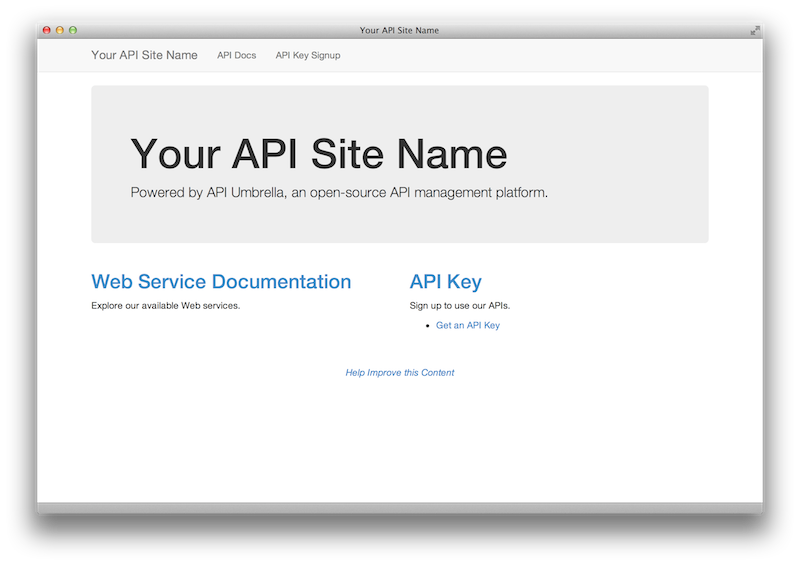
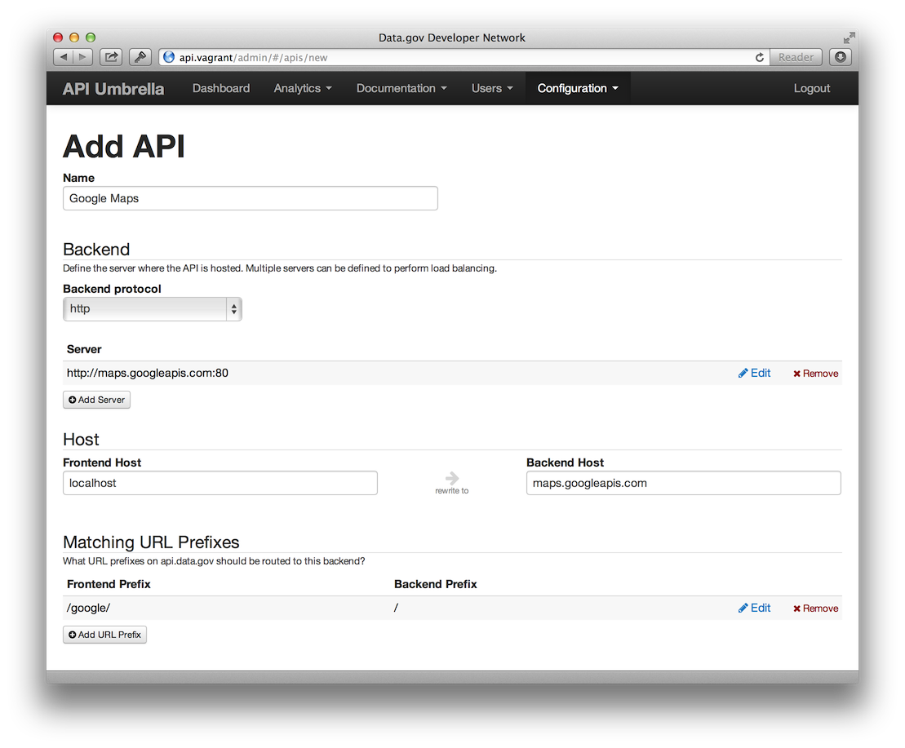
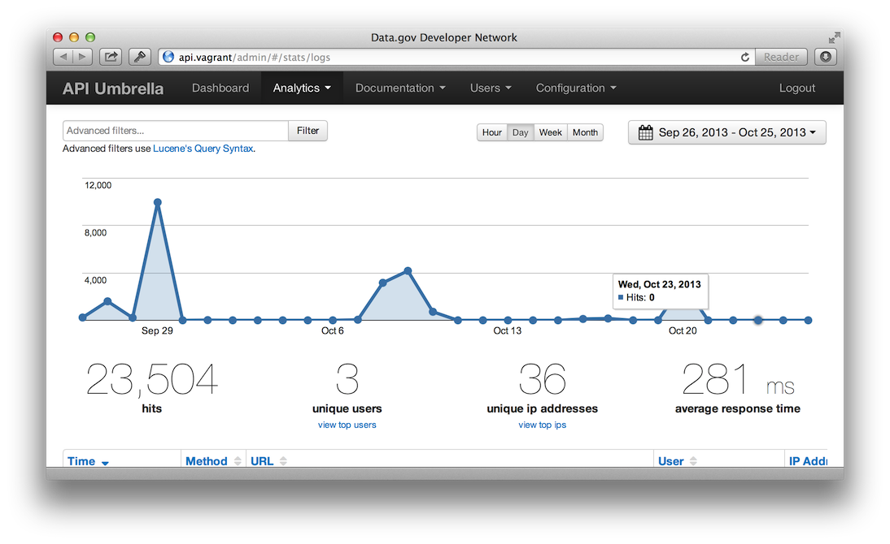

<h1>Getting Started</h1>

## Installation

### Installing From Binary Packages

**Debian 8 (Jessie)**

```sh
$ echo "deb https://dl.bintray.com/nrel/api-umbrella-debian jessie main" | sudo tee /etc/apt/sources.list.d/api-umbrella.list
$ sudo apt-get update
$ sudo apt-get install api-umbrella
```

**Debian 7 (Wheezy)**

```sh
$ echo "deb https://dl.bintray.com/nrel/api-umbrella-debian wheezy main" | sudo tee /etc/apt/sources.list.d/api-umbrella.list
$ sudo apt-get update
$ sudo apt-get install api-umbrella
```

**Enterprise Linux 7 (CentOS/RedHat/Oracle/Scientific Linux)**

```sh
$ curl https://bintray.com/nrel/api-umbrella-el7/rpm | sudo tee /etc/yum.repos.d/api-umbrella.repo
$ sudo yum install api-umbrella
```

**Enterprise Linux 6 (CentOS/RedHat/Oracle/Scientific Linux)**

```sh
$ curl https://bintray.com/nrel/api-umbrella-el6/rpm | sudo tee /etc/yum.repos.d/api-umbrella.repo
$ sudo yum install api-umbrella
```

**Ubuntu 14.04 (Trusty)**

```sh
$ echo "deb https://dl.bintray.com/nrel/api-umbrella-ubuntu trusty main" | sudo tee /etc/apt/sources.list.d/api-umbrella.list
$ sudo apt-get update
$ sudo apt-get install api-umbrella
```

**Ubuntu 12.04 (Precise)**

```sh
$ echo "deb https://dl.bintray.com/nrel/api-umbrella-ubuntu precise main" | sudo tee /etc/apt/sources.list.d/api-umbrella.list
$ sudo apt-get update
$ sudo apt-get install api-umbrella
```

### Installing With Chef

If you use [Chef](https://www.chef.io) for managing your servers, we provide a [cookbook](https://github.com/NREL-cookbooks/api-umbrella) that can be used to install the binary packages and configure API Umbrella.

### Running With Docker

In this simple example, custom API Umbrella configuration can be defined in the `config/api-umbrella.yml` file on host machine. This gets mounted as `/etc/api-umbrella/api-umbrella.yml` inside the container, which is the path for the configuration file the rest of the documentation will reference.

```sh
$ mkdir config && touch config/api-umbrella.yml
$ docker run -d --name=api-umbrella -p 80:80 -p 443:443 -v "$(pwd)/config":/etc/api-umbrella nrel/api-umbrella
```

### Installing From Source Code

Installing from a binary package is recommended, if available ([let us know](https://github.com/NREL/api-umbrella/issues/new) if you'd like to see binary packages for other platforms). However, if a binary package is not available you can [compile from source](developer/compiling-from-source.html).

## Setup

- Start API Umbrella:

  ```sh
  $ sudo /etc/init.d/api-umbrella start
  ```

- Browse to your server's hostname. You should land on the default homepage:

  

Congrats! You're now up and running with API Umbrella. There are a variety of things you can do to start using the platform. Read on for a quick tutorial:

## Quick Tutorial

### Login to the web admin

A web admin is available to perform basic tasks:

`https://your-api-umbrella-host/admin/`

The very first time you access the admin, you'll be given a chance to create your first admin account.

### Add API Backends

Out of the box, API Umbrella doesn't know about any APIs. You must first configure the API backends that will be proxied to.

In this example, we'll proxy to Google's Geocoding API (but you'll more likely be proxying to your own web services).

**Step 1:** Login to the [web admin](http://your-api-umbrella-host/admin/) and navigate to the "API Backends" section under the "Configuration" menu.

**Step 2:** Add a new backend:



**Step 3:** Navigate to the "Publish Changes" page under the "Configuration" menu and press the Publish button.

Google's API should now be available through the API Umbrella proxy.

### Signup for an API key

On your local environment, visit the signup form:

`https://your-api-umbrella-host/signup/`

Signup to receive your own unique API key for your development environment.

### Make an API request

Assuming you added the Google Geocoding example as an API backend, you should now be able to make a request to Google's Geocoding API proxied through your local API Umbrella instance:

```
http://your-api-umbrella-host/google/maps/api/geocode/json?address=Golden,+CO&sensor=false&api_key=**YOUR_KEY_HERE**
```

You can see how API Umbrella layers its authentication on top of existing APIs by making a request using an invalid key:

```
http://your-api-umbrella-host/google/maps/api/geocode/json?address=Golden,+CO&sensor=false&api_key=INVALID_KEY
```

### View Analytics

Login to the [web admin](http://your-api-umbrella-host/admin/). Navigate to the "Filter Logs" section under the "Analytics" menu. As you make API requests against your API Umbrella server, the requests should start to show up here (there may be a 30 second delay before the requests show up in the analytics).



## Next Steps
